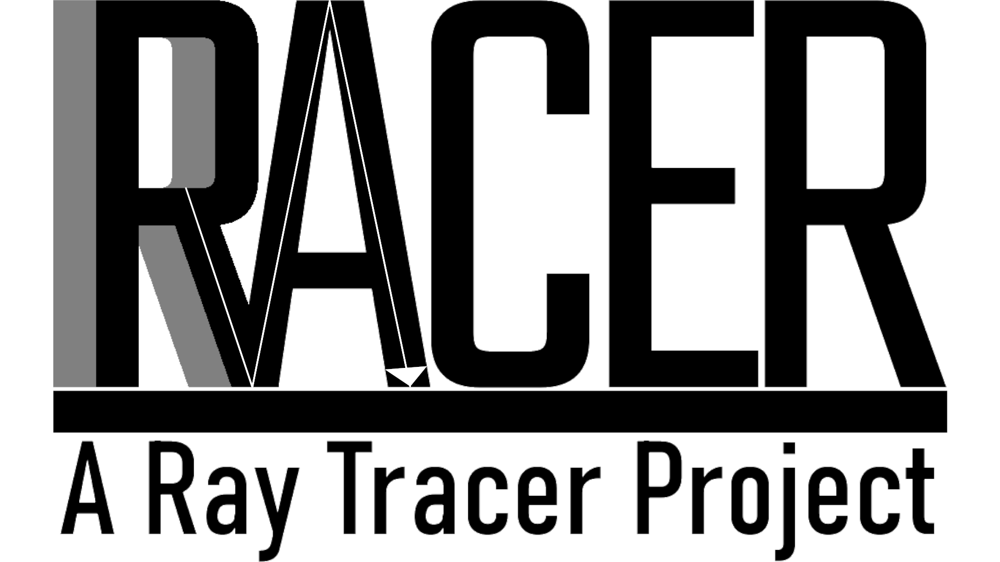
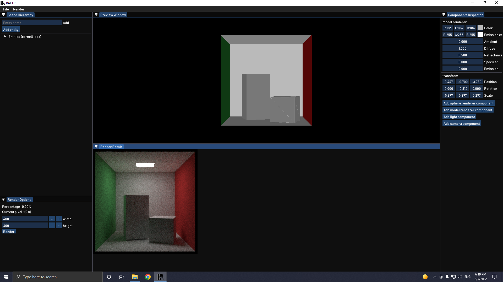
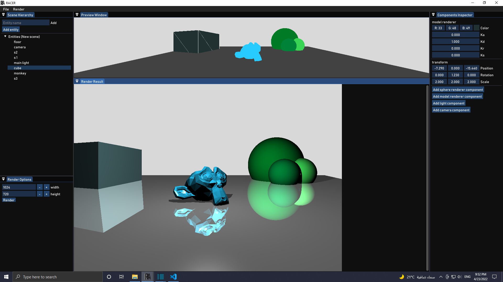
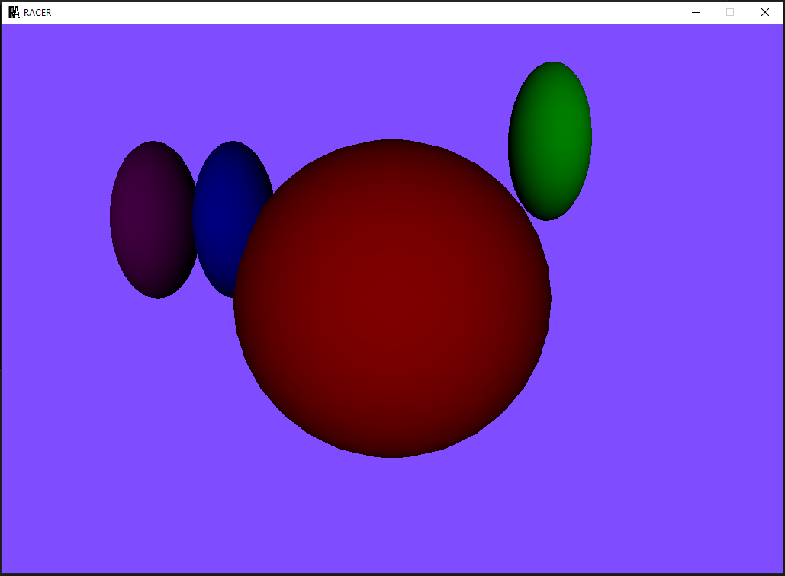
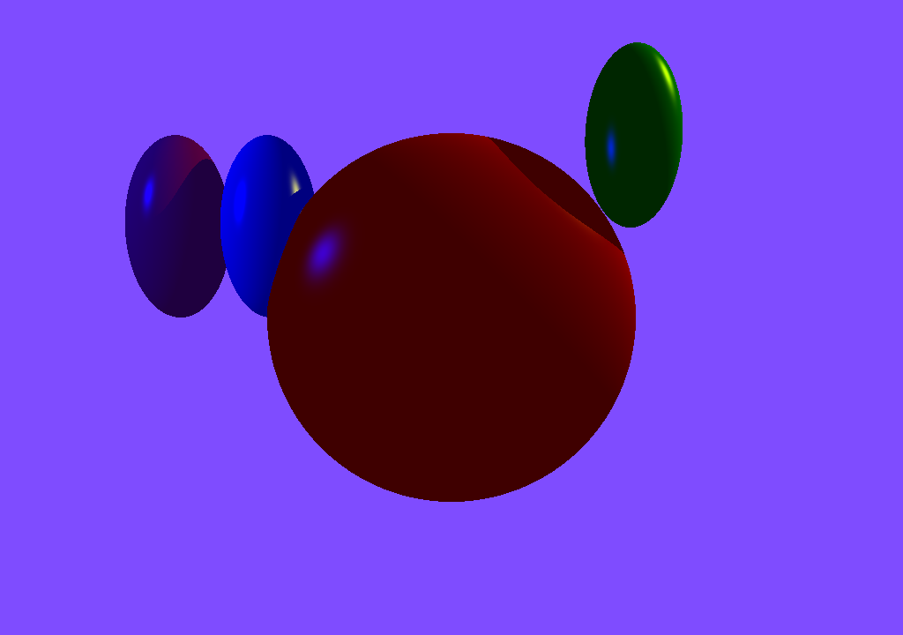
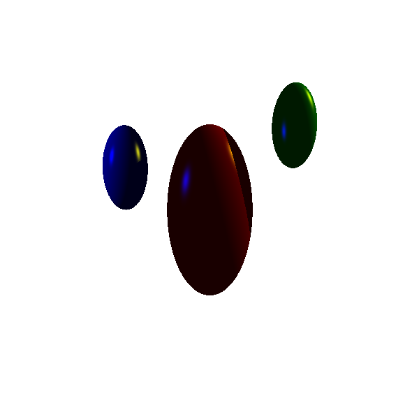

#  Racer Engine

A ray tracing engine developed in c++, with real time preview and edit using openGL and ImGUI.

Create for practice. 

## Development documentation:
## 5. Emissive objects instead of point lights

In action preview:

---

## 4. 3D Model loading and rendering

In action preview:

---
## 3. GUI window for adjusting data

In action preview:

---
## 2. Real-time preview then rendering
| Real-time preview | Rendered Image |
|-------------|:-------------:|
|||

In action preview:

---
## 1. Simple spheres ray tracing:
Rendering an image given a file with spheres positions (Position, Scale, Color, Reflection properties), lights and camera properties.
| Input file|Image|
|-------------|:-------------:|
|NEAR 1 LEFT -1 RIGHT 1 BOTTOM -1 TOP 1 RES 600 600 SPHERE s1 0 0 -10 2 4 2 0.5 0 0 1 1 0.9 0 50 SPHERE s2 4 4 -10 1 2 1 0 0.5 0 1 1 0.9 0 50 SPHERE s3 -4 2 -10 1 2 1 0 0 0.5 1 1 0.9 0 50 SPHERE s4 0 0 -1 0.25 0.25 0.5 0 0 0.5 1 1 1 0 50 LIGHT l1 0 0 -1 0.3 0.3 0.3 LIGHT l2 10 10 -10 0.9 0.9 0 LIGHT l3 -10 5 -5 0 0 0.9 BACK 1 1 1 AMBIENT 0.2 0.2 0.2||
---

## TODO list and improvements:
- [x] Correct reflection.
- [x] Seperate files and create application structue.
- [x] More seperation files and create application structue.
- [ ] Add more complex shapes.
- [ ] Implement OBJ importing with materials.
- [x] Replace the input file to be in a JSON formula.
- [x] Use OpenGL to live show effects.
- [x] Use ImGUI to make changes in scene.
- [ ] Use ImGizmos to actively manipulate the scene.
- [ ] Introduce threading to the project.
- [ ] Try to use graphics card in accelerating.
- [ ] Commenting.
- [x] Styling using google sheets.
